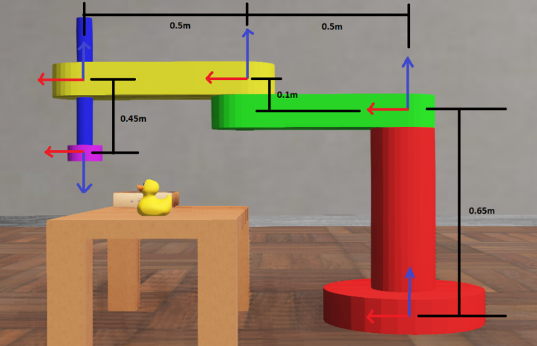
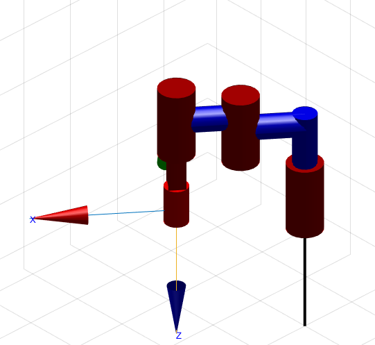

# Projeto-SCARA

Projeto final da disciplina de Robótica 2022.2 ministrada pelo professor Ícaro Araújo.

## Objetivo do projeto

O projeto proposto deve simular um robô SCARA capaz de realizar uma atividade do tipo _pick and place_, com uma cena disponível no simulador _Webots_ (disponível na imagem abaixo). O robô SCARA deve pegar o objeto (pato de borracha) e colocá-lo em cima da caixa de papelão. Para isso, será necessário utilizar a API do simulador em _python_ para implementar as funções que executem a atividade proposta.

## Rodando o projeto

Texto.

## Utilizando Robotics Toolbox - Peter Corke (MatLAB) para verificar a correta definição dos parâmetros DH para o Projeto SCARA.

